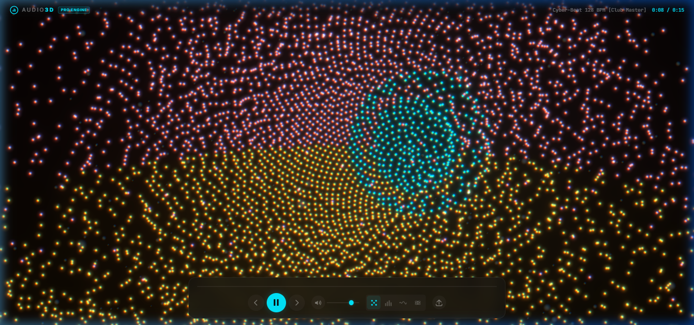
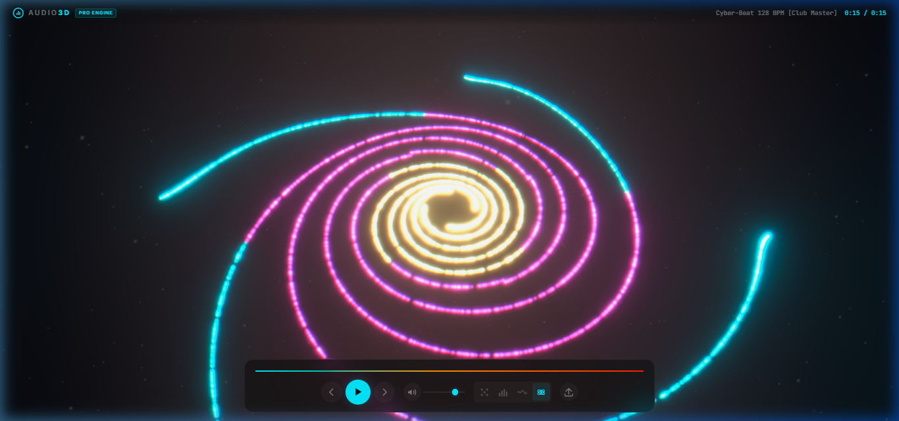

# 🎧 Audio3D — Expérience Visuelle 3D Interactive

Transformez vos morceaux préférés en un spectacle visuel 3D immersif et vibrant directement dans votre navigateur. Chargez votre musique en un clic et laissez les basses, mélodies et percussions sculpter l'espace en temps réel.

🔒 **100% Privé & Local** : Vos fichiers audio restent sur votre machine. Aucun envoi sur un serveur externe.

---

## 📸 Aperçu des Univers Visuels

### ✨ Sphère de Particules
Un nuage dense de milliers de particules lumineuses qui pulse au rythme des percussions et s'étend dans toutes les directions.



---

### 🌌 Galaxie Cosmique
Une spirale galactique multicolore dont les bras dansent et s'étirent en harmonie avec le tempo et les montées de vos morceaux.



---

## 🚀 Les 4 Modes de Visualisation

- **✨ Particules Laser** : Une sphère vivante d'étincelles multicolores qui explose sur chaque coup de basse et vibre sur les hautes fréquences.
- **📊 Barres Spectrales** : Une arène circulaire d'égaliseurs verticaux néon avec sommets lumineux flottants.
- **🌊 Onde 3D** : Un ruban fluide de vagues superposées qui retranscrit fidèlement le relief et la texture sonore de votre musique.
- **🌌 Galaxie en Rotation** : Un voyage spatial à 5 bras cosmiques tournoyants qui respirent et changent de teintes au fil du morceau.

---

## ⚡ Prise en Main Rapide

### 1. Installation

```bash
git clone https://github.com/BaldeAl/audio3D.git
cd audio3D
npm install
npm run dev
```

Ouvrez ensuite [http://localhost:5173/](http://localhost:5173/) dans votre navigateur.

---

## 🎮 Comment l'Utiliser

1. **Glissez-déposez** votre fichier audio (MP3, WAV, FLAC, OGG, AAC) n'importe où sur l'écran ou cliquez sur **« Charger un fichier local »**.
2. **Pas de fichier sous la main ?** Cliquez simplement sur **« Tester avec le Cyber-Beat Démo »** pour lancer une piste électro 128 BPM générée instantanément.
3. **Changez d'univers à la volée** grâce aux icônes du panneau de contrôle inférieur.
4. **Contrôles clavier & souris :**
   - `Barre d'espace` : Lecture / Pause
   - `Clic gauche + glisser` : Tourner la caméra autour de la visualisation 3D
   - `Molette de la souris` : Zoomer / Dézoomer
   - `Boutons ±10s` : Avancer ou reculer rapidement dans le morceau
